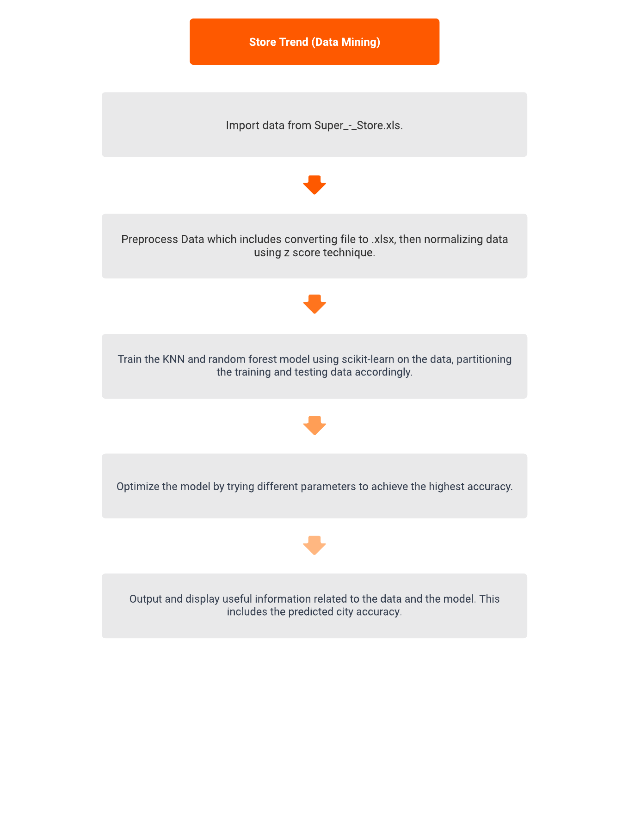

# Store Trend Prediciton
A data mining related application.

## Team Members:
- Tyler Thompson
  - Email: tylert123@yahoo.com
- [Team Member 2]
- [Team Member 3]

## Introduction

### Problem Statement
In all industries, it is important to understand the target consumers to maximize profits and sales. To elaborate, consumer data is extremely important to analyze and identify any trends that might appear. Consumers can follow certain tendencies depending on the area in which they reside, and as a company, it is important to understand which products they purchase. On top of this, understanding a purchase's profit is also essential to indicate which sales are profiting the most. The scope of this application is to use KNN classification to identify targeted cities and profits within the dataset. 

### Objective
This application aims to show a city's likelihood of purchasing a product from an office store. This includes products such as furniture and work supplies. In addition to this, there will also be further classification on the profit associated with each purchase and what that product might be. Since there is such a broad range of products, this should give an indicator of which cities are buying which items the most, as well as what products were purchased given a price. The premise of this application could prove useful when it comes to showing a company where they would want to focus efforts and sales. This application uses the [Anaconda distribution](https://www.anaconda.com/) for Python which includes a plethora of machine learning packages.

### Motivation
The motivation behind this project includes attempting to simulate a real-world data mining application that involves collaborative teamwork and extensive knowledge within the field. Understanding consumer data is a crucial need for many companies, and this application provides insights to the programmers developing it on what a company could expect from their consumers. On top of this, comprehending the algorithms behind this application, as well as the processes and techniques, is essential knowledge for the developers.

### Related Work
There are a few related topics to this application, including retail analytics, market basket analysis, geospatial analysis, customer segmentation, predictive modeling, and collaborative filtering. Most of these topics fall within the same scope as this project, incorporating certain techniques from both retail analytics and predictive modeling. Additionally, there is an endless number of projects based on these topics. Some similar projects include determining average sales in an order, identifying the most valuable consumers, and deciding on products to order based on location. Inspiration is drawn from everything previously discussed. 

## Data

### Data Source and Format
The dataset is from [Sample Super Store](https://community.tableau.com/s/question/0D54T00000CWeX8SAL/sample-superstore-sales-excelxls) and appears in the December Tableau user group presentation. The file type is a .xls file, which is an older Excel file. This dataset includes 9,994 different purchases from various cities within the United States and Canada. There are many features within this dataset. However, the important ones to consider for this application are category, product name, sales, quantity, discount, and profit. The label for the first part of our application is, of course, the city. When it comes to the next part of our application, we will need to take profit into consideration and try to determine which products were purchased.

Concerning the various feature types, we can observe that it includes a large portion of numerical features, categorical features, and ordinal features. The ordinal feature arises from the ship mode feature, but once again, it is not considered important for this application. This application mostly deals with numerical and categorical features. It is important to note this since, in order to be efficient when training the model, many features can be disregarded. With around 10,000 different entries in this file, there is plenty of data to experiment with.

### Data Example
The following is an example of the dataset before any preprocessing steps were taken. 

## Methodology

### Schematic Diagram/Framework
The following is the structure and processes of the application.

### Data Visualization and Preprocessing
The preprocessing of the data inlcuded a few steps to allow the model to begin working with the data. These steps include the following, convert the .xls file into a .xlsx file. This is because pandas needs the file to be in the updated format, and since this data set is older, this step was needed. The next step inlcuded normalizing the data, which once again involved the pandas package. The normalizing technique used is minimum maximum normalization. It can also also refered to as minimum maxiumum scaling. This technique takes the specified columns and normalizes them to be between 0 and 1. The columns that this was applied to include, sales, quantity, discount, and profit. The data was then ready to be trained on.

How miniumum maximum normalization works

### Procedures and Features
[Explain the procedures followed and the features used]

## Experiments

### Data Division (Training/Testing)
[Detail how you divided your data into training and testing sets]

### Parameter Tuning
[Discuss any parameter tuning performed]

### Evaluation Metrics
[Specify the metrics used to evaluate your model]

### Results (Tables/Graphs)
[Present results in the form of tables and graphs]

### Analysis of the Results
[Analyze and interpret the obtained results]

## Conclusion

### Discuss Any Limitation
[Highlight limitations encountered during the project]

### Discuss Any Issue Not Resolved
[Discuss any issues that remain unresolved]

### Future Direction
[Propose potential directions for future work]

## Appendix

### Snapshots and Others
[Include relevant snapshots, code snippets, or any additional materials]

## References
[List the references and sources used in your project]
