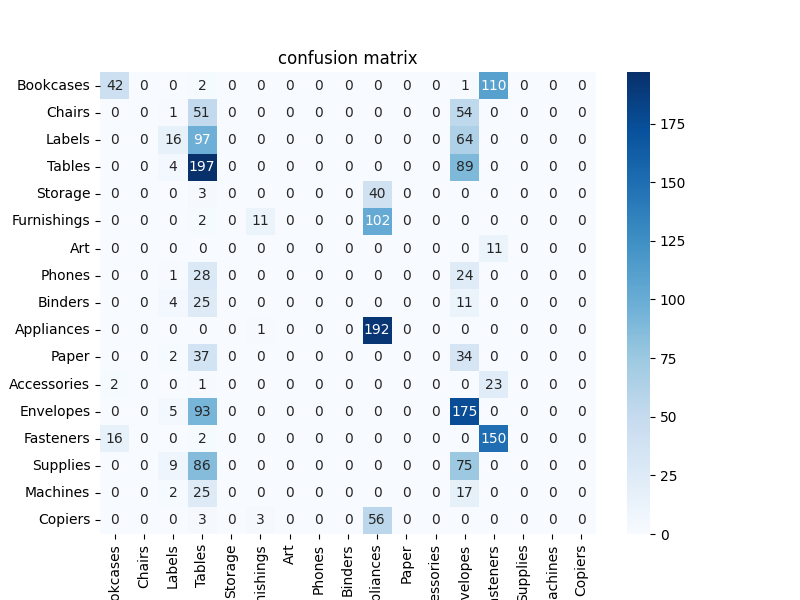
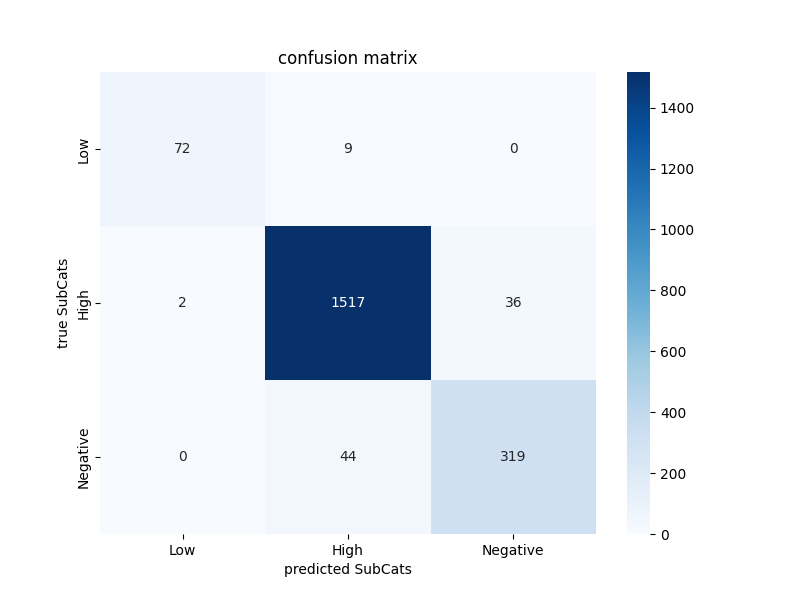

## Store Trend Prediction
*A data mining related application.*

### Building and Launching the Application
- Please go to [Link to setting up venv](Setting_Up_Venv.md) to learn how to set up the virtual environment for this project. Follow the instructions to install all necessary packages. This project requires the Anaconda distribuition of Python.
- After configured correctly navigate to the the main directory of the project. You can then begin to run the main.py script which contains the KNN portion of the project.
- Also run Random_Forest.py to run the random forest portion of the application.
- Make sure directories are correct as paths may change.

### Team Members:
- Tyler Thompson
  - Email: tylert123@yahoo.com
- Xiang Liu
  - Email: 1784676846.xl@gmail.com  
- Nikolay Sizov
  - Email: madisona.mail@gmail.com

### Introduction

#### Problem Statement
In all industries, it is important to understand the target consumers to maximize profits and sales. Consumer data is crucial for analyzing and identifying trends. Consumers exhibit certain tendencies based on their location, and companies need to comprehend which products they are inclined to purchase. Additionally, understanding the profitability of each purchase is essential to identify the most lucrative sales. This application utilizes multiple algorithms to achieve this. It uses KNN classification to pinpoint targeted cities and predict profits within the dataset. In addition to this, it uses random forest to determine the profit of each sale.

#### Objective
This application aims to predict the likelihood of a city purchasing a product from an office store, such as furniture and work supplies. It further classifies the profits associated with each purchase and identifies the specific products contributing to those profits. By discerning which products are frequently purchased in specific cities and understanding the profit margins, companies can tailor their sales strategies more effectively. The application is developed using the Anaconda distribution for Python, which incorporates various machine learning packages.

#### Motivation
This project is motivated by the need to simulate a real-world data mining application that involves collaborative teamwork and extensive knowledge within the field. Understanding consumer data is crucial for companies seeking insights into consumer behavior. The application provides valuable information on what products a company can expect its consumers to purchase and the associated profits. Furthermore, gaining a deep understanding of the algorithms, processes, and techniques used in this application is essential knowledge for the developers.

#### Related Work
Several related topics align with this application, including retail analytics, market basket analysis, geospatial analysis, customer segmentation, predictive modeling, and collaborative filtering. The project draws inspiration from techniques in retail analytics and predictive modeling. Similar projects involve determining average sales per order, identifying valuable consumers, and optimizing product orders based on location.

### Data

#### Data Source and Format
The dataset is sourced from [Sample Super Store](https://community.tableau.com/s/question/0D54T00000CWeX8SAL/sample-superstore-sales-excelxls) and is presented in an Excel format (.xls). This dataset comprises 9,994 purchases from various cities in the United States and Canada. Key features include category, product name, sales, quantity, discount, and profit. The primary label for the application is the city. The dataset incorporates numerical, categorical, and ordinal features, with a focus on numerical and categorical features for efficient model training. The sample data, consisting of around 10,000 entries, allows for robust experimentation.

#### Data Example
Below is an excerpt from the dataset before the preprocessing steps:

### Methodology

#### Schematic Diagram/Framework
The application's structure and processes are depicted in the following schematic diagram:

#### Data Visualization and Preprocessing
Data preprocessing involved several steps to prepare the dataset for model training. Firstly, the.xls file was converted to.xlsx to meet the updated format requirements of Pandas. Normalization was then performed using the minimum-maximum and Z_score normalization techniques. This involved scaling specific columns, such as sales, quantity, discount, and profit, to a range between 0 and 1, ensuring uniformity for effective model training. At first, we used the minimum-maximum normalization technique, but the scaling didn't come out correctly. For example, $-300 of profit and $20 of profit all have the same scaling value, which doesn't seem correct. Then we normalize the data using the Z-Score technique. The scaling looks correct when the profit is high, showing a positive value that is above 0, which means it is above the average profit, and when the profit is super low, it shows a negative value below 0, which means it is below the average profit or even negative. So we decided to use the Z-Score technique.

##### Normalization Technique

#### Z-Score Technique

#### Procedures and Features
The methodology employed in this project encompasses several key procedures and features. The initial step involves exploratory data analysis (EDA) to gain insights into the distribution and relationships within the dataset. Following this, feature selection is conducted to identify the most influential variables for model training. Features such as city, category, sub-category, sales, quantity, discount, and profits are crucial for predicting consumer behavior and profitability.

The algorithm applied was the K-Nearest Neighbors (KNN) classification algorithm, Random Forest Regression, and Random Forest Classification

The original algorithm utilized is the K-Nearest Neighbors (KNN) classification algorithm. KNN identifies patterns based on the similarity of instances, making it suitable for predicting city preferences and associated profits and sub-categories. Additionally, feature scaling techniques are applied to ensure that no single feature dominates the model training process. But the result and the accuracy didn't come out great; the best accuracy we can get is 22% even with the parameter tuning. In order to increase accuracy we changed the number of columns included into kNN algorithm. Instead of using single column, we started using eleven columns. Then tested with the applied Random Forest Classification algorithm with the same features (profits and sub-categories) and target (city), the accuracy only increased by about 10%, which still didn't meet expectations.

Second, we decided to change our features and target to see if we could get better accuracy and training scores as well. The feature we focused on was subcategory, category, sales, quantity, and target profit using the random forest regression algorithm. The result is still not good because the profit is a continuous value, regression doesn’t perform well at around 50% accuracy, and the training score is 83%. Then we categorized the profit into high, low, and negative for-profit and used the same feature and a random forest classifier model to predict the result, which came out so much better for profit. In the categorization, if the value is greater than $200, the profit is set to be high, under $200-$0, and negative if the value is less than $0. The accuracy was able to get up to 87%, and the training score was 89%. We discussed the result with the team members, and we applied the "discount" column to our features as well. The result is surprisingly great; the accuracy went up to 95% and the training score went up to 99.6%

### Experiments

#### Data Division (Training/Testing)
To assess the model's performance accurately, the dataset is divided into training and testing sets. Approximately 80% of the data is allocated for training, allowing the model to learn patterns, while the remaining 20% is reserved for testing to evaluate its predictive capabilities. Stratified sampling is implemented to maintain the distribution of feature sets, ensuring representative training and testing subsets.

#### Parameter Tuning
##### Parameter tuning is a critical aspect of optimizing the KNN and Random Forest models. 
##### KNN:
- The selection of the optimal number of neighbors (K) is crucial for the model's accuracy. A systematic approach, such as cross-validation, is employed to iterate through various K values and identify the configuration that yields the best results. K was set to 200.
- Random state parameters in machine learning algorithms, including the KNN and Random Forest classifiers, serve as a seed for the random number generator used by the algorithm. This parameter is used to ensure reproducibility. When you provide an integer value for a random state, it makes the output of the algorithm deterministic, meaning that you can expect the same results in multiple runs of the
algorithm with the same input data and parameter settings. Random State was set to 42 in KNN Classifier.
- Weights: This parameter determines how the classification is weighted when making a prediction. The options are typically 'uniform' (where all points in each neighborhood are weighted equally), 'distance' (where points are weighted by the inverse of their distance, so closer neighbors have a greater influence), or a custom function. Weights was set to 'uniform'.

- Algorithm: This specifies the algorithm used to compute the nearest neighbors. Options include 'ball_tree', 'kd_tree', 'brute', and 'auto'. The 'auto' option attempts to decide the most appropriate algorithm based on the values passed to fit method. Algorithm was set to 'auto'.

- leaf_size: This parameter can affect the speed of the construction and query, as well as the memory required to store the tree. The leaf size is passed to the BallTree or KDTree algorithms. In general, it does not affect the actual results, but it can impact the speed of the query and the memory required to store the constructed tree. Leaf_size was set to 30.

- p: This parameter is related to the choice of metric; when p = 1, this is equivalent to using manhattan_distance (l1), and euclidean_distance (l2) for p = 2. For arbitrary p, minkowski_distance (lp) is used. It effectively determines the power parameter for the Minkowski metric. p value was set to 2.

- Metric: This determines the distance metric used for the tree. The default metric is minkowski, and with p=2 is equivalent to the standard Euclidean metric. Other common options include 'euclidean', 'manhattan', 'chebyshev', 'hamming', 'canberra', and 'braycurtis', or any other valid distance metric supported by scipy.spatial.distance. Metric was set to 'euclidean' distance method.

##### Random Forest Classifier
- Random state parameters in machine learning algorithms, including the KNN and Random Forest classifiers, serve as a seed for the random number generator used by the algorithm. This parameter is used to ensure reproducibility. When you provide an integer value for a random state, it makes the output of the algorithm deterministic, meaning that you can expect the same results in multiple runs of the
algorithm with the same input data and parameter settings. Random State was set to 100 in RF Classifier.
- N_estimators serve in Random Forest classifier is the number of trees in the forest. Typically, the more trees, the better the performance, but it also means a longer training time. N_Estimators was set to 250.
- Max_depth serve The maximum depth of each tree. Deeper trees can model more complex patterns but can also lead to overfitting. Max depth of the tree was set to 20.

#### Evaluation Metrics
The performance of the model is evaluated using several metrics, including accuracy, precision, recall, and F1-score. Accuracy provides an overall measure of the model's correctness, while precision and recall offer insights into the model's ability to predict positive instances correctly and capture all positive instances, respectively. The F1 score combines precision and recall, providing a balanced assessment of the model's performance.

#### Results (Tables and Graphs)

##### KNN Model

Here we can see the graphs related to the KNN algorithm training results. 

##### Confusion matrix for KNN

##### Precision for KNN

##### Recall for KNN

##### Support for KNN

##### F1 Score KNN

##### Random Forest Model

And below we can see the graphs related to the Random Forest algorithm training results. 

##### Confusion matrix for Random Forest

##### Precision for Random Forest

##### Recall for Random Forest

##### Support for Random Forest

##### F1 Score Random Forest

The results of the experiments are presented in the form of tables and graphs. A confusion matrix is generated to visualize the model's performance in predicting city preferences and associated profits.

#### Analysis of the Results
The analysis of results involves interpreting the metrics and visualizations to draw meaningful conclusions. Insights are gained into which cities exhibit similar purchasing behavior, the most profitable products in specific regions, and any patterns that may guide strategic business decisions. Any discrepancies between predicted and actual outcomes are thoroughly investigated to understand potential areas for improvement.

### Conclusion

#### Discuss Any Limitation
Despite the model's success in predicting city preferences and profits, certain limitations exist. The model assumes that consumer behavior remains constant over time, and external factors, such as economic changes or global events, are not considered. Additionally, the dataset's geographical scope is limited to the United States and Canada, potentially limiting the model's applicability to a broader international context.

#### Discuss Any Issue Not Resolved
One unresolved issue pertains to the interpretability of the model's decisions. While the model can make accurate predictions, understanding the underlying reasons for specific predictions remains a challenge. Further research into interpretable machine learning techniques may address this issue.

#### Future Direction
Future work could involve enhancing the model's predictive capabilities by incorporating more sophisticated machine learning algorithms, such as ensemble methods or neural networks. Additionally, expanding the dataset to include a more diverse set of regions and demographics would contribute to a more comprehensive understanding of consumer behavior. Collaboration with domain experts in retail and data science could provide valuable insights and further refine the model.

### Appendix

#### Snapshots and Others

### References
